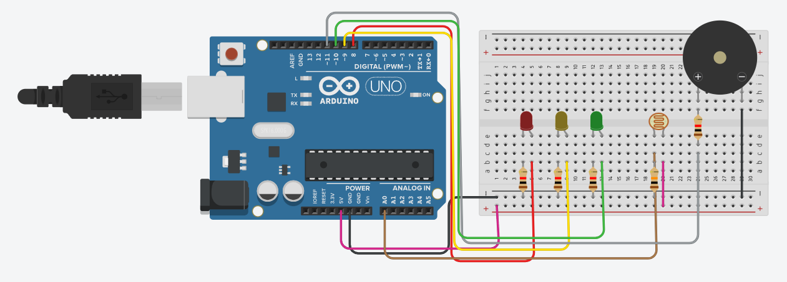

# Vinharia Agnello - Sistema de Monitoramento do Ambiente
Este projeto tem como principal objetivo atender às necessidades da Vinheria Agnello, que preza pela qualidade e tradição de seus vinhos. Para isso, foi desenvolvido um sistema de monitoramento de luminosidade utilizando Arduino, capaz de identificar as condições de luz no ambiente e alertar o usuário por meio de LEDs e um buzzer quando os níveis estiverem fora do ideal.

Nesta primeira etapa, o sistema está focado no monitoramento da luminosidade por meio de um sensor LDR (Light Dependent Resistor). Futuramente, a proposta é expandir o projeto para incluir o monitoramento de outras variáveis importantes, como temperatura e umidade do ambiente.

---

## Objetivo
Desenvolver um sistema capaz de:
- Monitorar a luminosidade do ambiente utilizando um sensor LDR;
- Indicar o estado do ambiente por meio de LEDs;
- Emitir alerta sonoro com buzzer quando a luminosidade estiver fora do ideal.  

---

## Dependências

### Hardware
- Arduino Uno;
- Sensor LDR;
- LEDs (verde, amarelo e vermelho);
- Resistores (220Ω); 
- Buzzer;
- Protoboard;
- Jumpers.

### Software
- Tinkercad (simulação);
- Arduino IDE.

---

## Como Reproduzir

1. Monte o circuito em um Arduino com protoboard, ou no Tinkercad; 
2. Conecte o LDR à entrada analógica do Arduino;  
3. Conecte os LEDs às portas digitais com os resistores; 
4. Conecte o buzzer a uma porta digital;  
5. Faça o upload do código para o Arduino (Código disponível neste repositório);
6. Execute o código com o circuito montado;
7. Varie a luminosidade no LDR para testar os diferentes estados do sistema.

---

## Lógica e Funcionamento do Sistema
O sensor LDR fornece valores analógicos entre 0 e 1023, que representam a intensidade da luz no ambiente. Com base em limites definidos no código, o sistema determina o estado da luminosidade e aciona os LEDs e o buzzer conforme necessário. Ou seja, o Arduino realiza a leitura dos valores analógicos e, com base nesses dados, classifica o nível de iluminação em três estados:

- **Ideal:** LED verde aceso  
- **Alerta:** LED amarelo aceso  
- **Crítico:** LED vermelho aceso + buzzer ativado por 3 segundos  

Caso a luminosidade permaneça inadequada, o buzzer será acionado novamente.

### Circuito do Projeto

  

---